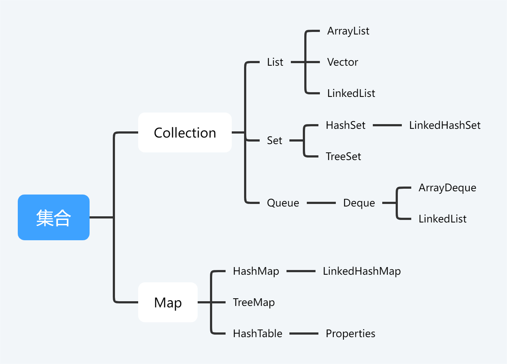

# Collection

# List

List类似python的列表，只不过方法不一样，比如python的list利用append()进行元素添加，而List利用add()进行元素添加。

具体方法看[官方帮助文档](https://docs.oracle.com/en/java/javase/17/docs/api/index.html)。

## ArrayList的扩容机制

+ 无参构造时容量未进行初始化，第一次扩容直接变为10个元素，后续每次扩容将容量扩为1.5倍

+ 指定容量构造时，初始为指定容量，后续若所需容量大于数组容量，则扩容1.5倍

## Vector和ArrayList的区别

+ ArrayList是线程不安全的，Vector 是线程安全的——**ArrayList效率更高**。
+ ArrayList 使用默认构造器创建对象时是在调用 add() 方法时对 ArrayList 的默认容量进行初始化的，Vector 在调用构造器时就对容量进行了初始化
+ ArrayList 存储数据的 Object 数组使用了 transient 关键字（序列化时忽略被transient修饰的属性），Vector 的 Object 数组没有
+ ArrayList 和 Vector 的扩容机制不同（Vector为2倍扩容）
+ Vector 可以设置增长因子，而 ArrayList 不可以

# Set

Set中不允许有重复的元素，`HashSet`是无序的，`LinkedHashSet`可以保证**元素添加的顺序**，`TreeSet`可以保证**元素自然的顺序**。

## HashSet

HashSet中的元素是**无序**的，它底层是用`HashMap`实现的，大概就是用一个`HashMap<val, PRESENT>`实现，其中`PRESENT`为一个常量`Object`，占位的。

## LInkedHashSet

继承了`HashSet`，**底层利用双向链表保证添加顺序**。

# Queue

`Queue`即队列，遵循**FIFO**即**先进先出**原则。

其方法总结：

|         | Throws exception | Returns special value |
| ------- | ---------------- | --------------------- |
| Insert  | add(e)           | offer(e)              |
| Remove  | remove()         | poll()                |
| Examine | element()        | peek()                |

通过测试可得：**在尾部插入，在头部删除。**

~~~java
Queue<Integer> queue = new LinkedList<>();

queue.offer(1);
queue.offer(2);
queue.offer(3);

System.out.println(queue); //[1, 2, 3]

queue.poll();

System.out.println(queue); //[2, 3]

queue.offer(1);

System.out.println(queue); //[2, 3, 1]

System.out.println(queue.peek());   //2

System.out.println(queue); //[2, 3, 1]
~~~

## Deque

`Deque`为双端队列，即**两端都可以进行插入和删除**。

`Deque`也是接口，其实现子类有`ArrayDeque`和`LinkedList`等。

`Duque`也可以用做栈，所以`Stack`已经不推荐了，一般用`Deque`来实现一个栈，它包含了栈了三个主要操作：

| peek()       | push(e)   | pop()            |
| ------------ | --------- | ---------------- |
| 返回栈顶元素 | 将e压入栈 | 将栈顶出栈并返回 |

至于插入等操作则是新增了`First`和`Last`的区别，如`offer()`就有`offerFirst()`和`offerLast()。

对应关系如下：

| offer()                          | poll()                         | peek()                         | element()                    |
| -------------------------------- | ------------------------------ | ------------------------------ | ---------------------------- |
| *offerFirst()* and *offerLast()* | *pollFirst()* and *pollLast()* | *peekFirst()* and *peekLast()* | *getFirst()* and *getLast()* |

~~~java
Deque<Integer> deque = new LinkedList<>();

deque.offerFirst(1);
deque.offerFirst(2);
deque.offerFirst(3);

System.out.println(deque);  //[3, 2, 1]

deque.offerLast(1);
deque.offerLast(2);
deque.offerLast(3);

System.out.println(deque);  //[3, 2, 1, 1, 2, 3]

System.out.println(deque.peek());   //3

System.out.println(deque.contains(3));  //true

System.out.println(deque.size());   //6
~~~

`offerFirst`头插，`offerLast`尾插。

## 测试Deque实现栈是从那边插和删

~~~java
Deque<Integer> stack = new LinkedList<>();

stack.push(1);
stack.push(2);
stack.push(3);

System.out.println(stack);  // [3, 2, 1]

stack.pop();

System.out.println(stack);  // [2, 1]

stack.pop();

System.out.println(stack);  // [1]
~~~

可以看到是**在头部进行插入和删除。**
