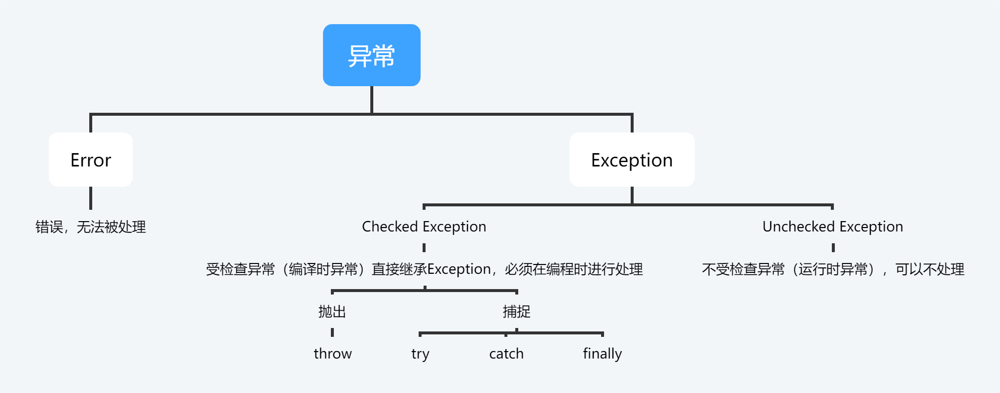

# Exception

# Error和Exception

异常分为两种：`Error`和`Exception`。

其中，`Error`为错误，是无法处理的异常，如Java虚拟机运行异常等，而`Exception`则为可以被处理的异常。

而`Exception`又分为**编译时异常**（注意并不是说编译的时候才出错，而是因为不处理就不能编译，所以才叫编译时异常，二者都是在运行时出错的）和**运行时异常**。

编译时异常直接继承`Exception`，而运行时异常继承`Exception`的一个子类`RuntimeException`。

**编译时异常发生概率大，而后者发生概率小。**

# 处理编译时异常的方式

## 抛出

就是将异常甩给上一级，自己不管事，让上一级去处理。

可以在函数签名后面抛出：

~~~java
public void fun() throw Exception{
	...
}
~~~

也可以在方法体里抛出：

~~~java
public void fun(){
    throw Exception;
}
~~~

如果在main方法中抛出那就是交给JVM去处理，那就会导致JVM停止运行，所以一般不建议在main函数继续向上抛，而是利用***try...catch***进行捕获处理。

## 捕获

捕获主要是用***try...catch...finally***语句进行异常捕获并对异常进行处理，如：

~~~java
try{
	...
}catch(Exception e){
	...
}finally{
	...
}
~~~

注意catch可以有多个，其参数为想要捕获的异常，注意由于多态，可以利用父类异常捕获子类异常。

其参数也可以利用|符号进行连接：

~~~java
try{
	...
}catch(IOException | ClassNotFoundException e){
    ...
}
~~~

意思是捕获`IOException`或者`ClassNotFoundException`。

**try子句对代码块内的代码进行尝试，若出错则由catch捕获，并停止向后执行。**

**finally子句是不管是否出现异常，最后都会执行的代码，如可以进行文件流的关闭等，而且一定会执行。**

# 自定义异常

处了JDK自带的异常外，还可以自定义异常，必须继承`Exception`或者`RuntimeException`类，而且要实现其无参构造和有参构造。

~~~java
public class MyException extends Exception {
    public MyException() {
        super();
    }

    public MyException(String message) {
        super(message);
    }
}
~~~

自定义异常需要由程序员自己该抛出的时候抛出：

~~~java
if(某种异常发生的条件){
	throw new MyException("发生了");
}
~~~

# Others

下列代码返回的是什么：

~~~java
public void fun(){
	int i = 0;
	try{
		return i;
	}finally{
		++i;
	}
}
~~~

***finally***子句必须执行，但是由于程序必须是按照从上至下的顺序来执行的，所以当到return的时候，方法必然结束，什么时候执行++i呢？

在java程序中有两条铁律，分别为**必须从上至下执行**，**return必须最后执行**，为了同时满足这两条铁律，编译的时候会生成类似这样的代码：

~~~java
int i = 0;
int j = i;
++i;
return j;
~~~

这样既做到了return最后执行，又做到了从上到下执行（即返回的必然是i而不是++i后的i）。