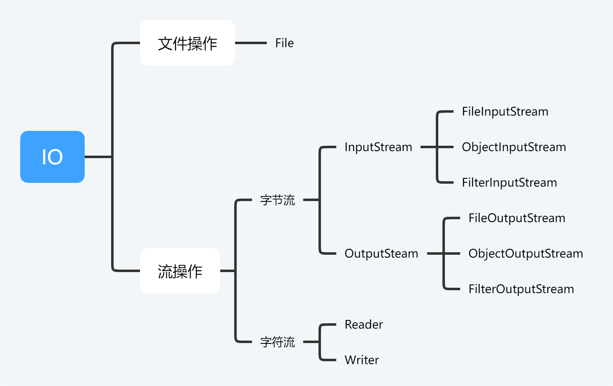

# IO



# 文件操作

通过**File**类来实现对文件的操作。

它的构造方法有如下几种：

```java
File(File parent, String child)
```

由**父目录实例对象和子路径**创建文件实例对象。

```java
File(String pathname)
```

由**路径名**创建文件实例对象。

```java
File(String parent, String child)
```

由**父目录和子路径**创建文件实例对象。

File对象包括一些对文件的操作方法，如创建文件的***createNewFile()***，删除文件的delete()等等。

# 流操作

Java中对文件的操作是通过流的形式来进行的，通过不同的操作流的类对不同的流进行操作。

## 字节流和字符流

流对象按照操作对象可分为**字节流和字符流**，字符流是方便对文本进行操作的流，故若对文本进行操作一般建议用字符流。而如果要对视频、图片、音乐等文件进行操作，就需要借助字节流。

## 节点流和处理流

还可以按照功能分为**节点流和处理流**，节点流是直接对流进行操作，而处理流则是对节点流的进一步包装，实现一些更复杂的功能的扩展等等，常用的处理流就有BufferedInputStream等等。

## 对象流

如果需要将一个对象的值和类型都进行存储，那么就需要用到对象流。

**将一个对象的值和类型一起转换为流的过程叫做序列化，其反过程成为反序列化。**

需要注意的是若要对一个对象进行序列化，需要实现一个标记接口`Serializable`：

~~~java
public class A implement Serializable{
	private static final long serialVersionUID = 1L;
}
~~~

`serialVersionUID`是为了提高版本兼容性加的一个版本号，一般建议加上，这样若A类需要增加属性，则会认为是一个之前的A类的新版本。

**tips：**

+ 注意被`static`或`transient`修饰的属性是不会被序列化的。
+ 如果类的某个属性是另一个类，那么属性类也必须实现序列化接口。
+ 序列化具有继承性，如果一个类可被序列化，那么它的子类也能被序列化。

## Properties流

专门用来读取properties配置文件的流，里面提供了像***load()，store()，getProperty()***等一系列对配置文件进行操作的方法。
